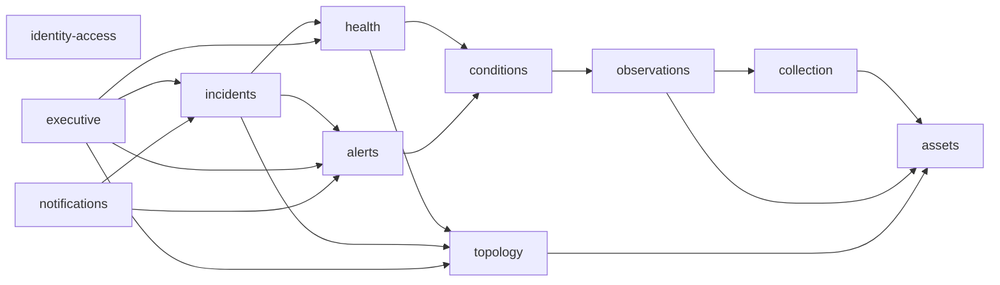

# MVP codebase design

Status: Ready for scaffolding

Date: 2026-07-13

## Design outcome

The MVP remains one modular monolith with four runtime surfaces:

1. one React Web application
2. one NestJS HTTP API process
3. one NestJS Platform Worker process built from the same NestJS codebase
4. one Go Collector process containing the MVP SNMP, probe, and Trap protocol roles

PostgreSQL, VictoriaMetrics, and `vmalert` remain external runtime dependencies with the authority defined by the accepted ADRs. There is no Redis, broker, workflow engine, microservice framework, or container orchestrator in the codebase design.

The design favors deep Modules: each business capability exposes a small Interface and hides its domain rules, persistence, idempotency, and error handling in one Implementation. HTTP controllers, Worker handlers, and protocol clients are Adapters at the outer Seams; they do not contain business rules.

## Workspace defaults

- Use native npm workspaces for TypeScript packages. Do not add Nx, Turborepo, Lerna, or another repository task orchestrator until the native workspace demonstrably fails.
- Use one root `package-lock.json` and one root TypeScript configuration baseline.
- Use one root Go module for all MVP Go code and generated Go contracts. Do not add `go.work` until the repository actually has independently versioned Go modules.
- Build the NestJS API and Worker once from `apps/platform` and start the same artifact with different commands.
- Build one Go Collector binary for the MVP. SNMP polling, active probes, and Trap receipt remain internal Modules, not separate network services.
- Keep generated wire types separate from domain types. No frontend or Go code imports NestJS domain implementation.
- Add directories only when their first real file is implemented; the tree below is a target layout, not a request to create empty folders.

## Monorepo structure

```text
.
├── package.json                 # npm workspace commands only
├── package-lock.json
├── tsconfig.base.json
├── go.mod                       # one Go module for the MVP
├── apps/
│   ├── web/                     # React + TypeScript + Vite SPA
│   │   └── src/
│   │       ├── app/             # router, providers, session shell
│   │       ├── features/        # assets, topology, alerts, incidents, executive
│   │       └── ui/              # genuinely shared presentation primitives
│   └── platform/                # one NestJS codebase, two long-running entries
│       ├── src/
│       │   ├── main.ts          # HTTP API entry
│       │   ├── worker.ts        # non-HTTP Platform Worker entry
│       │   ├── migrate.ts       # explicit migration command, not a service
│       │   ├── bootstrap/
│       │   │   ├── api-app.module.ts
│       │   │   └── worker-app.module.ts
│       │   ├── modules/         # deep business Modules
│       │   └── database/        # connection, transaction, migration state
│       └── migrations/          # one ordered PostgreSQL migration stream
├── services/
│   └── collector/
│       ├── cmd/collector/main.go
│       └── internal/
│           ├── app/             # process lifecycle and task coordination
│           ├── snmp/            # SNMPv2c/v3 and interface collection
│           ├── probe/           # TCP, ICMP, HTTP(S), and DNS probes
│           ├── trap/            # Trap listener and protocol normalization
│           └── platformclient/  # task and result protocol Adapter
├── packages/
│   └── contracts/
│       ├── openapi/
│       │   ├── public.yaml      # Web-facing HTTP Interface
│       │   └── internal.yaml    # Collector and vmalert service Interface
│       ├── schemas/             # SSE and durable envelope schemas
│       └── generated/
│           ├── typescript/      # Web/API wire types and client
│           └── go/              # Collector wire types and client
├── tests/
│   ├── contract/                # schema and generated-client compatibility
│   ├── integration/             # cross-Module and cross-process tests
│   ├── e2e/                     # browser-to-platform critical journeys
│   ├── recovery/                # backup, restart, lease, and restore scenarios
│   ├── capacity/                # MVP-S1 workload assets, added when implemented
│   └── fixtures/                # shared protocol and topology fixtures only
├── deploy/                      # Compose, proxy, metrics, backup, and operations assets
├── mib/                         # reviewed MIB source data, not application code
├── profiles/                    # reviewed collection/profile data when specified
└── docs/
```

`apps/platform` is deliberately not named `apps/api`: the package owns both accepted NestJS runtime roles, while `main.ts` and `worker.ts` keep those roles operationally separate.

## Runtime Modules and Seams

### React Web

`apps/web` is one SPA. Its Interface to the platform is only the generated public HTTP client and the versioned SSE event envelope.

Feature Modules follow user capabilities rather than backend table names: authentication, assets, topology, observations, alerts, incidents, executive dashboard, and administration. A feature may contain its pages, queries, view models, and local UI state. Shared `ui/` contains only presentation primitives used by more than one feature; it is not a generic utility dumping ground.

The Web application does not import NestJS DTOs, entities, ORM models, database types, or Go structures. It maps generated wire types into feature view models where the presentation needs a different shape.

AntV G6, if selected after evaluation, stays inside the topology rendering Module. The Module Interface accepts a bounded topology view model and emits selection, navigation, and layout-change events; callers do not learn G6 graph objects. ECharts remains an Implementation detail of chart Modules. Do not create a generic graph or chart framework before a second real implementation exists.

### NestJS HTTP API

The HTTP API Adapter owns:

- public REST and dedicated Executive Dashboard endpoints
- local authentication, Session, TOTP, CSRF, and permission enforcement
- private service-authenticated task and ingest endpoints
- request validation, actor and correlation context, and audit context
- synchronous commands and queries that fit the accepted latency budget
- SSE connection authorization and delivery

Controllers map validated wire input to application commands and map application results to wire output. They do not open ad-hoc transactions, perform Condition or Health computation, poll devices, claim Jobs, or call external notification channels.

Private Go and `vmalert` routes perform only service authentication, envelope validation, bounded per-item validation, and durable Inbox acceptance before returning. Their business effects run in Platform Worker.

### NestJS Platform Worker

The Platform Worker Adapter owns the process lifecycle for:

- Inbox consumption and dispatch
- Direct Fact and composite Condition evaluation
- Metric Condition Evaluation consumption and reconciliation
- incremental Health calculation and full consistency verification
- asynchronous Alert processing
- Outbox dispatch and Notification Delivery work
- freshness, expiry, Session cleanup, and temporary-data cleanup
- scheduled lower-priority work

Worker handlers invoke the same application Interfaces used by HTTP commands. They never call public HTTP endpoints to reuse business logic. One Worker process hosts all MVP handlers, but each handler is registered separately so later measured concurrency changes do not require rewriting the domain Module.

### Go Collector

The MVP Go process is one binary with internal protocol Modules. It owns SNMPv2c/v3, TCP/ICMP/HTTP/DNS probing, Trap receipt, protocol parsing, protocol-level normalization, source timestamps, Collector identity, bounded concurrency, retry, and batch submission.

It does not read PostgreSQL directly. It claims or receives Collection Tasks and submits Observation or Normalized Fact batches through the private internal HTTP Interface. This keeps the accepted future distributed-Collector Seam without introducing a broker or remote-node management in the MVP.

The Go process never decides final Health Status, Health Score, Alert Instance, Incident, maintenance behavior, formal topology, RBAC, or business thresholds. It may report protocol facts such as `ifOperStatus = DOWN` and execution facts such as timeout or task rejection.

One binary is the recommended default because all roles run on the same MVP host and share lifecycle, Collector identity, metrics, and submission behavior. Split binaries require measured isolation or scaling evidence and a later codebase decision.

## NestJS Module shape

The initial business Module set is:

| Module | Owns | Must not own |
| --- | --- | --- |
| `identity-access` | Platform Users, credentials, TOTP, Sessions, Roles, Permissions | asset or monitoring rules |
| `assets` | Managed Asset identity, Desired/Observed/Effective fields, matching, imports, replacement | protocol polling |
| `topology` | formal and candidate relations, differences, layout, approved dependencies | device identity or health calculation |
| `collection` | Collector identity, Collection Tasks, probe definitions, credential references | protocol implementation or final health |
| `observations` | source envelopes, provenance, normalization, current fact projection | Alert or Health policy |
| `conditions` | definitions, versions, assignments, dependencies, evaluations, publication and reconciliation | Alert episode or Health policy outcomes |
| `health` | policies, Current Health, transitions, snapshots, score explanations | MetricsQL execution or Alert state |
| `alerts` | rules, bindings, fingerprints, episodes, acknowledgement, suppression | shared Condition predicates or Incident lifecycle |
| `incidents` | declaration, links, impact snapshot, timeline, ownership, close and reopen | Alert detection state |
| `notifications` | delivery attempts, channel Adapters, retry outcomes | Alert or Incident authority |
| `executive` | allowlisted aggregate read Interface | credentials, configuration commands, raw administrative responses |
| `audit` | append-only security and business audit with redaction rules | feature-specific decisions |
| `reliable-work` | Inbox, Outbox, Jobs, attempts, leases, retries, Dead Letters | business meaning of Job payloads |

Inside a Module, use only the directories that contain real behavior:

```text
modules/<name>/
├── public.ts                    # the Module Interface used by callers and tests
├── domain/                      # pure invariants and state transitions, when needed
├── application/                 # commands, queries, and orchestration
└── adapters/
    ├── postgres/                # concrete PostgreSQL Implementation
    ├── http/                    # HTTP Adapter, only when exposed
    └── worker/                  # Job/Inbox Adapter, only when consumed
```

Do not create empty layer folders, one Interface per class, repository ports for every table, or pass-through Modules. PostgreSQL behavior such as `SKIP LOCKED`, uniqueness, transaction isolation, and advisory locks is tested against PostgreSQL rather than hidden behind a fake repository that cannot reproduce it.

Create a port only at a real Seam with at least a production and test Adapter, such as VictoriaMetrics, `vmalert` configuration/reload, notification channels, system clock, filesystem rule publication, or the Go task/result client. Internal pure computation needs no Adapter.

## Dependency direction

Within every NestJS Module, dependency direction is:

```text
HTTP Controller / Worker Handler
             -> application Interface
             -> domain Implementation

PostgreSQL / VictoriaMetrics / filesystem / notification Adapter
             -> application-owned port at a real Seam
```

The domain never imports NestJS, HTTP, SQL, an ORM, generated wire types, or Docker configuration. Composition roots wire Adapters to application Interfaces.

Across business Modules, `A -> B` means A may use B's `public.ts` Interface but cannot import B's domain internals, controllers, Worker handlers, or PostgreSQL Adapter:



Additional rules prevent cycles:

- `conditions` never depends on `alerts`, `health`, or `incidents`.
- `health` and `alerts` are sibling consumers and never depend on each other.
- `incidents` is downstream of Alert, Health Impact, and topology.
- `executive` is read-only and no authoritative Module depends on it.
- `reliable-work` and `audit` do not import business Modules. The Worker composition root registers business handlers by Job or message kind.
- Cross-Module after-commit effects use Outbox or Jobs. A required in-transaction invariant uses a direct in-process Interface; Outbox is not used merely to imitate microservices.
- Cross-Module identifiers are immutable value types or contract fields, not imported ORM entities.

## Independent API and Worker entry points

`apps/platform/src/main.ts` is the only public NestJS bootstrap. It creates `ApiAppModule`, configures HTTP security and validation, installs shutdown hooks, and listens on the configured address.

`apps/platform/src/worker.ts` creates `WorkerAppModule` with `NestFactory.createApplicationContext`, installs shutdown hooks, starts the Worker supervisor, and never calls `listen()`.

```text
main.ts
  -> ApiAppModule
       -> HTTP Adapters
       -> authentication and authorization
       -> command/query application Interfaces
       -> SSE delivery

worker.ts
  -> WorkerAppModule
       -> Inbox/Outbox/Job runners
       -> business Worker handlers
       -> reconciliation and scheduled work
```

There is no shared root `AppModule` that automatically starts both HTTP and background loops. Shared business Modules are imported deliberately into each composition root. The expected build outputs remain conceptually `dist/main.js` and `dist/worker.js`, allowing one image with two Docker commands.

`apps/platform/src/migrate.ts` is a short-lived operational entry point. It does not start API or Worker behavior.

## PostgreSQL reliable-work code boundary

`reliable-work` is one deep Module with a small Interface and concrete PostgreSQL Implementation.

### Inbox

The HTTP internal-ingest Adapter calls an Inbox acceptance Interface with source identity, protocol version, batch identity, item idempotency keys, received time, and bounded payload references. Acceptance persists valid items before returning success and reports mixed-batch rejections without applying domain effects.

Platform Worker claims Inbox Messages and dispatches them by registered message kind. Processing and completion occur in one transaction: verify idempotency, invoke the business application Interface, write any resulting Outbox or Job records, mark the Inbox item complete, and commit. The runner knows message mechanics; the business handler knows meaning.

### Transactional Outbox

Application commands append an Outbox Message through the same transaction object used for the authoritative change. Controllers and domain objects cannot publish directly to the network.

The Outbox dispatcher delivers with at-least-once semantics and a stable idempotency key. Destinations may be an internal projection, SSE event stream, notification Adapter, or controlled external call. A delivery result is recorded only after its durable effect.

### Background Job Queue

The Job runner owns claiming, finite leases, renewal, attempt history, retry classification, backoff, jitter, completion, and Dead Letter transition. Business handlers receive a typed payload reference plus execution context and return a classified result; they do not update queue mechanics themselves.

Worker composition registers `jobType -> handler`. The reliable-work Module therefore does not import feature Modules and cannot form a dependency cycle.

Use PostgreSQL row locking and `SKIP LOCKED` only for short queue claims. Use advisory locks only for the accepted low-cardinality singleton operations. Do not use a process-local mutex as the correctness mechanism.

### Default wake-up behavior

Start with bounded database polling and durable cursors. Do not add `LISTEN/NOTIFY` in the first scaffold. It may later reduce latency as a wake-up hint after measurement, but it never replaces Inbox, Outbox, Job, or cursor persistence.

## Common protocols and generated types

`packages/contracts` owns serialized Interfaces that cross a process or language Seam:

- public Web REST operations
- private Collector task claim and result submission
- private Observation, Trap, and Metric Condition Evaluation ingest
- SSE event envelopes and resume cursor
- common error, correlation, version, timestamp, batch, and idempotency envelopes

OpenAPI and JSON Schema files are authoritative for the wire shape. Runtime trust-boundary validation remains mandatory; generated static types do not replace validation.

Generated TypeScript and Go code lives under `packages/contracts/generated/`, is never edited manually, and contains no domain behavior. The recommended default is to commit generated outputs and make CI regenerate and fail on a diff, so ordinary builds do not require a generator to be installed globally.

The Web imports only the generated public TypeScript client. The NestJS HTTP Adapter may use generated wire types but maps them to application commands. The Go Collector imports only generated internal protocol types and client code. Domain Modules never import generated wire types.

Every internal envelope carries a protocol version, source identity, stable batch and item identity, UTC timestamps, and explicit error classification. Secret values, raw Session Tokens, TOTP material, unrestricted Trap bodies, and unbounded error text are prohibited from contracts and generated fixtures.

## Database and migration boundary

PostgreSQL is one database with one globally ordered migration stream at `apps/platform/migrations/`. Do not create one database, schema, or migration runner per Module.

Each migration declares its owning Module in its filename or header and changes only the accepted schema needed by that Ticket. Cross-Module foreign keys are allowed when they protect an immutable identity or required invariant; they are not avoided to simulate service isolation.

`apps/platform/src/database/` owns connection creation, transaction execution, migration-state inspection, and database health. Feature SQL or ORM mapping stays in the owning Module's `adapters/postgres/` directory. There is no reusable `packages/database` package because no second application owns this schema.

Production API and Worker startup verify that the database is at a supported migration version and fail closed on mismatch. They do not automatically run migrations. Development, CI, deployment, and recovery invoke the explicit migration command, record the result, and then start the long-running processes.

The ORM, query builder, and migration library remain Ticket-level choices. The codebase Interface requires transactions, parameterized queries, PostgreSQL uniqueness, row locks, `SKIP LOCKED`, advisory locks, and deterministic migration ordering regardless of library.

## Test layout and levels

The Module Interface is the primary test surface. Tests assert observable results and invariants rather than private class calls.

1. **Domain and application tests** live beside TypeScript source as `*.test.ts` and beside Go source as `*_test.go`. They cover pure state transitions, three-valued logic, matching rules, health selection, Alert episode identity, and retry classification without starting the whole application.
2. **Adapter integration tests** exercise PostgreSQL, VictoriaMetrics, filesystem publication, and protocol Adapters. PostgreSQL tests use a real compatible PostgreSQL instance because SQLite or an in-memory fake cannot prove leases, `SKIP LOCKED`, advisory locks, constraints, or concurrent transactions.
3. **Contract tests** under `tests/contract/` validate OpenAPI/Schema examples, generated TypeScript and Go compatibility, protocol version handling, and redaction constraints.
4. **Runtime integration tests** under `tests/integration/` start the API and Worker independently and verify Inbox acceptance, Worker processing, Outbox delivery, restart, lease expiry, idempotency, and fail-closed database behavior.
5. **Web tests** keep feature and component tests beside the React code. Browser journeys under `tests/e2e/` cover login/MFA, permissions, asset-to-observation flow, Alert/Incident handling, Session expiry, SSE closure, and Executive Dashboard data classification.
6. **Recovery tests** prove migration, backup restore, Session invalidation, stale lease recovery, and committed-work resumption.
7. **Capacity tests** are separate, reproducible suites that implement `docs/specs/mvp-s1-capacity-acceptance.md`; they are not run as ordinary unit tests.

Go protocol fixtures use package-local `testdata/` directories. Root `tests/fixtures/` contains only data shared across processes or languages. Do not maintain a second mirrored unit-test tree or mock every NestJS provider.

## Windows development and Ubuntu deployment constraints

- All application paths use repository-relative configuration and platform path libraries. No project file contains a Windows drive path or assumes `/home/...`.
- Root developer commands use npm workspace commands, Node scripts, Go commands, or cross-platform tools without Bash-only `&&`, shell expansion, `chmod`, `sed`, or symlink assumptions. POSIX-only production scripts stay under `deploy/` and are executed in Ubuntu or a Linux container.
- Treat paths and imports as case-sensitive in review and CI even though the default Windows filesystem is case-insensitive.
- Standardize text files and executable scripts through repository line-ending rules; Linux entry scripts use LF.
- Store timestamps as UTC instants and apply `Asia/Shanghai` only at presentation or explicitly defined reporting edges. Production NTP remains mandatory for TOTP and observation validity.
- Do not rely on host bind-mount ownership, executable bits, file watching, or atomic replacement behavior being identical on Windows and Linux. Rule-package publication uses same-filesystem temporary files plus rename and is tested on both platforms.
- Build release images and run production capacity tests on Linux. A successful Windows Node or Go build does not establish Ubuntu compatibility or MVP-S1 capacity.
- Prefer a Linux container build for the Go release. Keep CGO disabled when supported by the selected protocol libraries; if a required library needs CGO, document and test the Linux toolchain rather than assuming Windows artifacts are portable.
- ICMP requires platform-specific privileges. Keep it behind the probe Module Interface, use non-privileged test Adapters for normal tests, and grant only the minimal Linux capability required in production rather than running the container privileged. Windows manual ICMP integration may require elevation and must be explicitly marked.
- Run the Trap listener on an unprivileged container port such as UDP 1162 and map the production host's UDP 162 to it. Windows development uses an unprivileged port.
- Handle both Docker `SIGTERM` and interactive Windows termination paths so API and Worker stop accepting or claiming new work and leave transactions and leases recoverable.
- Secrets enter through environment or mounted Secret files with documented encoding. Code tolerates CRLF only at configuration parsing edges and never logs the raw value.

## First implementation phase

The first phase is a sequence of tracer bullets, not horizontal scaffolding for every future feature:

1. **Workspace baseline** — add npm workspaces, the root Go module, TypeScript baseline, cross-platform commands, and empty application packages only when each has its first buildable entry.
2. **Contract baseline** — define the smallest public health/authentication envelope and internal task/result/ingest envelopes; generate TypeScript and Go code and add regeneration-diff checks.
3. **Independent runtime bootstrap** — make `main.ts`, `worker.ts`, the React shell, and the Go Collector start and stop independently with health and version reporting only. Prove Worker starts no HTTP listener.
4. **Migration and transaction seam** — add the explicit migration command, PostgreSQL connection/transaction Module, migration-version check, and integration-test database lifecycle without business tables beyond the Ticket being implemented.
5. **Reliable-work tracer** — implement one private ingest message through Inbox, Worker claim, idempotent handler, Outbox result, retry, finite lease recovery, and Dead Letter visibility. This validates ADR-0013 before building domain volume.
6. **Identity and access tracer** — implement first-administrator bootstrap, local login, opaque Session, default-deny Permission check, TOTP requirement for one Sensitive Permission, and audit through the same transaction discipline.
7. **Managed-device and central-Collector tracer** — create one Managed Device Desired State and `central-default`, issue one explicit Collection Task, and preserve immutable identity and Collector provenance.
8. **Observation-to-health tracer** — have the Go Collector submit one safely simulated protocol fact, normalize it, evaluate one Direct Fact Condition, and independently produce one Current Health transition and one Alert episode through Worker.
9. **Operator Web tracer** — display the managed device, source freshness, Health Status, Alert state, and stale/unknown behavior through generated contracts and SSE without exposing administrative or credential fields.
10. **Expand by vertical capability** — add topology confirmation, controlled import, probes, metric Conditions through `vmalert`, Incident handling, and Executive Dashboard slices only after the preceding Interfaces and reliable path are verified.

Do not begin with every domain table, every endpoint, all vendor MIBs, a generic workflow engine, or a complete UI shell. The first completed slice must prove the hardest accepted seams: cross-language contract, PostgreSQL transaction, at-least-once Worker recovery, immutable identity, shared Condition Evaluation, and truthful unknown state.

## Non-blocking implementation defaults

These defaults allow scaffolding without reopening product discovery:

| Detail | Recommended default | Change trigger |
| --- | --- | --- |
| JavaScript workspace | npm workspaces | measured native-workspace failure |
| Repository task runner | none | reproducible build graph becomes a measured bottleneck |
| Go layout | one root module, one Collector binary | independent release or scaling need |
| NestJS image | one image, two commands | materially different runtime dependency or release cadence |
| Wire contract | contract-first OpenAPI/JSON Schema | approved tooling proves one generated source without duplicate authority |
| Generated clients | committed and regeneration-checked | repository size or generator stability becomes a measured problem |
| Worker wake-up | bounded PostgreSQL polling | latency evidence justifies `LISTEN/NOTIFY` as a hint |
| PostgreSQL tests | real PostgreSQL | no substitute is accepted for PostgreSQL-specific semantics |
| Migration execution | explicit command before process start | a future deployment ADR changes release orchestration |
| Trap development port | UDP 1162 | environment requires another non-privileged port |
| Internal time | UTC | none; display-zone conversion remains an edge concern |

Library names, ORM choice, exact retry values, lease duration, polling interval, code-generator selection, package names, and function names remain Ticket decisions. None blocks the workspace design.

## Explicit exclusions

- no business Module deployed as a separate microservice
- no Redis, BullMQ, NATS, Kafka, RabbitMQ, Temporal, or NestJS Microservices Transport
- no Kubernetes, Helm, operator, service mesh, or multi-host scheduler
- no shared database package intended for hypothetical future applications
- no direct PostgreSQL access from React or Go Collector
- no Worker public HTTP Interface
- no API-to-self HTTP calls for application behavior
- no duplicated domain types shared directly between Web, NestJS, and Go
- no repository Interface for every table or mock for every class
- no automatic production migration from API or Worker startup
- no speculative plugin system, generic workflow language, or service-per-Module directory tree
