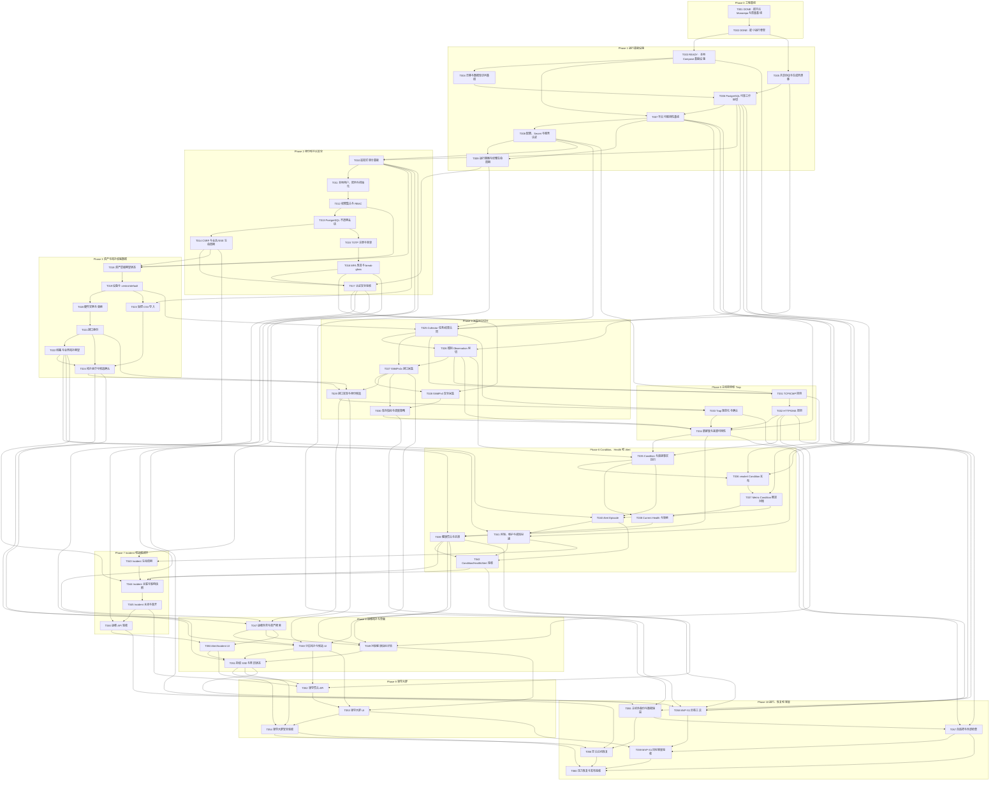

# MVP Ticket Dependency Graph

本图以 Ticket 编号为稳定节点。所有边都从前置 Ticket 指向被阻塞 Ticket；数字顺序本身也是合法拓扑顺序，因此不存在回边或循环。

## Mermaid

## 按阶段的文本顺序

1. **Phase 0 工程基线**：T001 → T002
1. **Phase 1 运行基础设施**：T003 → T004 → T005 → T006 → T007 → T008 → T009
1. **Phase 2 身份和平台安全**：T010 → T011 → T012 → T013 → T014 → T015 → T016 → T017
1. **Phase 3 资产与拓扑权威数据**：T018 → T019 → T020 → T021 → T022 → T023 → T024
1. **Phase 4 采集纵向切片**：T025 → T026 → T027 → T028 → T029 → T030
1. **Phase 5 主动探测和 Trap**：T031 → T032 → T033 → T034
1. **Phase 6 Condition、Health 和 Alert**：T035 → T036 → T037 → T038 → T039 → T040 → T041 → T042
1. **Phase 7 Incident 和运维闭环**：T043 → T044 → T045 → T046
1. **Phase 8 运维拓扑与界面**：T047 → T048 → T049 → T050 → T051
1. **Phase 9 领导大屏**：T052 → T053 → T054
1. **Phase 10 运行、恢复和容量**：T055 → T056 → T057 → T058 → T059 → T060

## 可并行前沿

- T001、T002 已完成，当前先执行 T003；T005 保持 PLANNED，后续仍可按依赖并行推进。
- T019 完成且各自其他前置已完成后，T020、T023、T025 可以并行。
- T027 完成后，T028 与已满足前置的 T031 可以并行；T032 和 T033 分属 Probe/Trap 路径。
- T037 完成后，Health 路径 T038/T039 与 Alert 路径 T040/T041 可在各自前置满足后并行，最终汇合到 T042。
- T047 后拓扑 T048、详情 T049 与已具备 API 的 T050 可并行，汇合到 T051。
- Phase 10 中 T055/T057 与 T058 的准备路径部分并行；T060 只在 T054、T056、T057、T059 全部 DONE 后开始。

## 当前首个可执行 Ticket

[T001：跨平台 Monorepo 与质量基线](T001-cross-platform-monorepo-quality-baseline.md) 和 [T002：最小运行骨架](T002-minimal-runtime-skeletons.md) 已为 DONE。[T003：本地 Compose 基础设施](T003-local-compose-infrastructure.md) 的全部前置依赖均已完成，因此是当前唯一 READY Ticket。

## DAG 检查规则

- 每张 Ticket 的全部依赖编号小于自身编号。
- Schema/合同 Ticket 位于使用方之前。
- UI Ticket 位于对应 API/领域合同之后。
- 容量数据工具 T058 位于目标容量 T059 和压力验收 T060 之前。
- 新增或修改依赖边后，必须重新执行文档自检并确认无循环。

